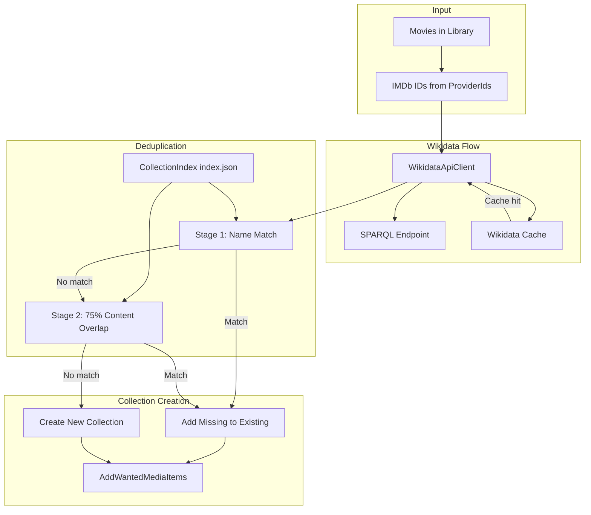

# Wikidata Collections Feature Plan

## Architecture Overview




## Key Files to Create/Modify


| File                                                                                             | Action                                                                           |
| ------------------------------------------------------------------------------------------------ | -------------------------------------------------------------------------------- |
| [WikidataApiClient.cs](Jellyfin.Plugin.AutoCollections/WikidataApiClient.cs)                     | **Create** - SPARQL client mirroring TmdbApiClient                               |
| [AutoCollectionsManager.cs](Jellyfin.Plugin.AutoCollections/AutoCollectionsManager.cs)           | **Modify** - Add ExecuteWikidataCollectionsAsync, index parsing, two-stage dedup |
| [PluginConfiguration.cs](Jellyfin.Plugin.AutoCollections/Configuration/PluginConfiguration.cs)   | **Modify** - Add EnableWikidataCollections, CollectionIndexPath                  |
| [configurationpage.html](Jellyfin.Plugin.AutoCollections/Configuration/configurationpage.html)   | **Modify** - Add Wikidata enable checkbox, optional index path                   |
| [AutoCollectionsController.cs](Jellyfin.Plugin.AutoCollections/Api/AutoCollectionsController.cs) | **Modify** - Include new config in API responses                                 |


---

## 1. Wikidata SPARQL Client (WikidataApiClient.cs)

Create a new client mirroring [TmdbApiClient.cs](Jellyfin.Plugin.AutoCollections/TmdbApiClient.cs):

- **Endpoint**: `https://query.wikidata.org/sparql`
- **User-Agent**: Required by Wikidata; use `Jellyfin.Plugin.AutoCollections/1.0` or similar
- **Rate limiting**: Add delay between requests (Wikidata recommends 1 req/sec for heavy use; start with ~500ms)
- **Methods**:
  - `GetSeriesByImdbIdAsync(string imdbId)` → returns `(string? seriesQid, string? seriesLabel, List<string> imdbIds)` or null
  - SPARQL logic:
    1. Resolve movie QID: `?movie wdt:P345 "tt1234567"` (P345 = IMDb ID)
    2. Get series: `?movie wdt:P179 ?series` (P179 = part of the series)
    3. Get members: `?series wdt:P527 ?member` UNION `?series wdt:P1445 ?member` (P527 = has parts, P1445 = fictional universe)
    4. Get IMDb IDs: `?member wdt:P345 ?imdbId`
    5. Get series label: `?series rdfs:label ?seriesLabel FILTER(LANG(?seriesLabel) = "en")`
- **Response parsing**: Wikidata returns JSON (`format=json` in URL) or XML; parse bindings for `series`, `seriesLabel`, `imdbId`
- **Deduplication**: Merge IMDb IDs from both P527 and P1445, deduplicate

---

## 2. Wikidata Cache (Separate from TMDB)

- **Path**: `Path.Combine(_pluginDirectory, "wikidata_series_cache.json")`
- **Structure**: `Dictionary<string, WikidataSeriesCacheEntry>` keyed by **series QID**
- **Entry**:

```csharp
  class WikidataSeriesCacheEntry {
      public string SeriesQid { get; set; }
      public string CollectionName { get; set; }
      public List<string> ImdbIds { get; set; }
      public DateTime LastChecked { get; set; }
  }
  

```

- **Logic**: Before SPARQL for a series QID, check cache; on hit, return cached data. On miss, query and cache.
- **TMDB cache**: Leave `tmdb_movie_collection_cache.json` and `LoadTmdbCache`/`SaveTmdbCache` completely untouched.

---

## 3. Collection Index Parsing

**Index path**: Default `Path.Combine(applicationPaths.DataPath, "plugins", "Jellyfin.Plugin.CollectionIndex", "index.json")`. Add optional config override `CollectionIndexPath` for custom installs (e.g. `C:\Jellyfin\Data\data\plugins\Jellyfin.Plugin.CollectionIndex\index.json`).

**Format** (from [index_example.json](index_example.json)):

```json
{
  "lastBuilt": "...",
  "totalItemsMapped": 1792,
  "totalCollections": 790,
  "isBuildInProgress": false,
  "index": {
    "15a831aa-3bc2-7a44-c8e8-4c0dba284828": [{"id": "8e080c35-3f40-72cc-0fca-4bf53c113d24", "name": "The Fast and the Furious Collection"}],
    ...
  }
}
```

- **Parse**: `index` is `Dictionary<string, List<CollectionIndexEntry>>` where key = media item ID (GUID), value = list of `{ id, name }`
- **Helpers**:
  - `GetAllCollectionNames()` → distinct collection names from index
  - `GetCollectionsForMediaItem(Guid mediaId)` → list of `{ id, name }` for that item
  - `GetCollectionMembers(Guid collectionId)` → set of media item IDs in that collection (reverse index)

---

## 4. Two-Stage Deduplication (Before Creating Any Wikidata Collection)

For each Wikidata candidate `(collectionName, imdbIds)`:

**Stage 1 – Name match**

- Get all collection names from index (case-insensitive).
- If any existing collection name equals `collectionName` (case-insensitive) → **match**. Use that collection’s ID.

**Stage 2 – Content overlap** (only if Stage 1 fails)

- Build map: IMDb ID → Jellyfin media item ID (from library `ProviderIds["Imdb"]`).
- For each Wikidata `imdbId` that exists in library, get its media item ID and look up collections in index.
- Tally: `collectionId → count` of how many candidate movies belong to that collection.
- If any collection has `count >= 3` and `count / candidateCount >= 0.75` → **match**. Use that collection’s ID.

**On match** (either stage):

- Do **not** create a new collection.
- Get current members of matched collection from index (or `GetLinkedChildren`).
- Diff: `missingIds = wikidataMemberIds - currentMemberIds`.
- Add only `missingIds` via `AddWantedMediaItems` (or equivalent).
- **Preserve existing collection name** (do not rename to Wikidata label).

**On no match**:

- Create new collection using same flow as TMDB: `CreateCollectionAsync`, `AddWantedMediaItems`, `RemoveUnwantedMediaItems`, `SortCollectionBy`, `SetPhotoForCollection`. Tag with `"Autocollection", "Wikidata"`.

---

## 5. ExecuteWikidataCollectionsAsync Flow

Mirror [ExecuteTmdbCollectionsAsync](Jellyfin.Plugin.AutoCollections/AutoCollectionsManager.cs) (lines 1583–1810):

1. Load Wikidata cache from `wikidata_series_cache.json`.
2. Load collection index from configured path (skip two-stage logic if file missing or invalid).
3. Get all movies from library.
4. For each movie with IMDb ID (`ProviderIds["Imdb"]`):
  - Call `GetSeriesByImdbIdAsync(imdbId)` (or use cache by series QID).
  - If no series → skip.
  - Build `Dictionary<string, WikidataCollectionCandidate>` keyed by series QID: `{ CollectionName, ImdbIds }`.
5. For each candidate:
  - Run two-stage dedup against index.
  - If match → merge (add missing items, preserve name).
  - If no match → create new collection.
6. Save Wikidata cache.

---

## 6. CreateOrUpdateWikidataCollectionAsync

- Similar to `CreateOrUpdateTmdbCollectionAsync` but:
  - **Before** create/update: run two-stage check.
  - If matched to existing collection: resolve `BoxSet` via `_libraryManager.GetItemById(matchedCollectionId)`, then add only missing items.
  - If new: use `GetBoxSetByName` (or create) with tags `"Autocollection", "Wikidata"`.
- Reuse: `RemoveUnwantedMediaItems`, `AddWantedMediaItems`, `SortCollectionBy`, `SetPhotoForCollection`, `ValidateCollectionContent`.

---

## 7. Configuration Changes

**PluginConfiguration.cs**:

- `EnableWikidataCollections` (bool, default false)
- `CollectionIndexPath` (string, optional override; empty = use default path)

**configurationpage.html**:

- Add checkbox for "Enable Wikidata Collections".
- Optional text input for "Collection Index Path" (with placeholder showing default).
- Load/save these in the existing config fetch/update flow.

**AutoCollectionsController**:

- Include `EnableWikidataCollections` and `CollectionIndexPath` in config get/set and import/export.

---

## 8. Integration into ExecuteAutoCollectionsNoProgress

In [AutoCollectionsManager.ExecuteAutoCollectionsNoProgress](Jellyfin.Plugin.AutoCollections/AutoCollectionsManager.cs) (after TMDB block, ~line 640):

```csharp
if (config.EnableWikidataCollections)
{
    try
    {
        await ExecuteWikidataCollectionsAsync();
    }
    catch (Exception ex) { ... }
}
```

---

## 9. IMDb ID Format and Library Lookup

- Jellyfin stores IMDb as `ProviderIds["Imdb"]` (or `"imdb"` – check Jellyfin source; typically `"Imdb"`).
- Format: `"tt1234567"` (with or without leading zeros).
- For library lookup by IMDb: iterate movies and match `ProviderIds["Imdb"]` or use `InternalItemsQuery` if Jellyfin supports IMDb filter (otherwise filter in memory).

---

## 10. Error Handling and Edge Cases

- **Index file missing**: Log warning; run without dedup (create all as new collections).
- **SPARQL timeout/error**: Log and skip that movie/series; continue with others.
- **Empty series**: Skip (e.g. series with < 2 members if desired; plan does not require minimum).
- **Duplicate series QIDs**: Deduplicate by QID before processing (already handled by dictionary keyed by QID).

---

## Implementation Order

1. Add `WikidataApiClient.cs` with SPARQL queries and parsing.
2. Add `WikidataSeriesCacheEntry`, `LoadWikidataCache`, `SaveWikidataCache` in AutoCollectionsManager (or a small helper).
3. Add index parsing and two-stage dedup helpers.
4. Implement `ExecuteWikidataCollectionsAsync` and `CreateOrUpdateWikidataCollectionAsync`.
5. Add config options and UI.
6. Wire `ExecuteWikidataCollectionsAsync` into `ExecuteAutoCollectionsNoProgress`.

